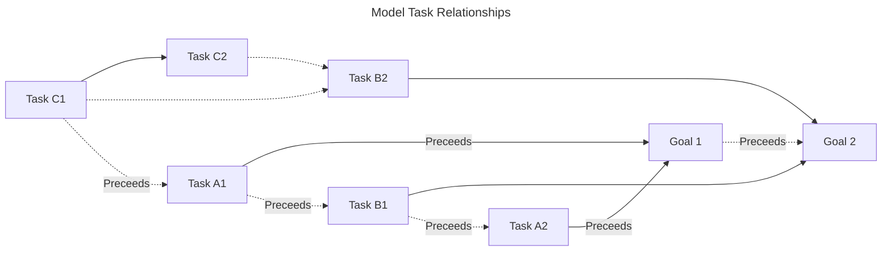

# Extract Markdown Tasks to Display

## Use Case

- Showcase functions that will live in a markdown tags library to use across #TidyObsidian and #MarkdownTools,
- Quality assurance checks to catch common markdown tasks issues, including duplicates and malformed.

## Configuration

- Run scripts from command-line, later be a function in CLI #TidyObsidian tool.

## Specifications

- Script helps extract and find duplicate tasks. Primarily turning tasks from Obsidian into standardized CSV output for looking at in another tool.
- With the `--fix-id true` be able to add ID to any task that doesn't already have one. 
  - Plus, that ID will be an Obsidian Tasks plugin Dataview compatible format.
- A task tree reversed, sorted by priority will show the tasks that need attention to finish chain of work.

Where:
- *Preceeds*, could be a `dependsOn` situation.
- *-->* is direct relationship,
- *-.->* is indirect relationship,

Descriptive:

- Neither `C1` nor `C2` are directly related to goals, hoewver, they are blocking movement of `A1` and `B2`.
  - How to discover thse dependencies?
  - How do start dates and due dates impact?

## Requirements

- Run fast. Use parallel processing to ingest a large volume of tasks. Minimize the reads to disk. Assume environment is slow with limited memory.
- Don't break. No modification of tasks without explicit request. Focus on bringing tasks out of a markdown note-taking application into a `pandas` array for manipulation.
- Allow analysis. There is an opportunity for aging, task trees, and displaying tasks in various reports. The primary objective is to complete tasks not contemplate them.
- Quality assurance check. Make sure the markdown task is in the right format for popular tools. Start with Obsidian Dataview Tasks.
- Use the `get_hash(text)` to maintain privacy when presenting reports. It also takes less screen space. It may be possible to determine exact match tasks.

## User Story

- User wants to know what tasks are in the critical path to complete a deliverable. 
  - From the command line (including over SSH) with access to markdown note-taking repo, they ask.
  - The ask identifies a catalog code or keyword, the script finds {Project, Deliverable, Milestone} task.
  - From that deliverable task, the script calculates priority of tasks, weighting those that contribute.
  - A short report presents task tree exposure showing what tasks are priority to address. Beyond blocking.

/EOF/